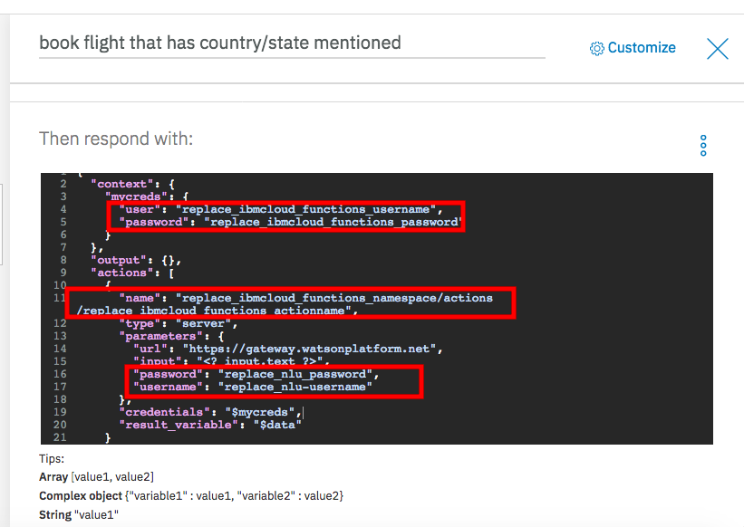

# Identifying correct source and destination of travel using Watson Knowledge Studio, Watson Natural Language Understanding and Watson Assistant.

* Build a custom model in Watson Knowledge Studio.
* Import that model into Watson Natural Language Understanding.
* Invoke Watson Assistant, which internally uses NLU to identify the source and destination in user queries.

### Watson Assistant response to user query with and without NLU(custom model)

## Flow


### How does Watson Knowledge Studio work?

The image below explains the process of how Watson Knowledge Studio works in light detail. For greater detail see Steps [4. Upload Type System](#4-upload-type-system) through [9. Deploy the machine learning model to Watson Natural Language Understanding](#Step-45-deploy-model-to-nlu-instance).


The process is as follows:

* We build a Type System specific to the business domain/use case.
* We follow human annotation process to identify entities and relationships.
* We create a machine learning model and train the model till we are satisfied with the results.
* The corpus document can be exported and used in a new WKS project, if required.
* We create a Watson Natural Language Understanding service from an IBM Cloud account.
* We create Watson Assistant and use Watson Natural Language Understanding service to interpret source and destination in user query.

### Technical Architecture

This image shows the relationships and data flows between the major components of this Code Pattern:

> Note: In the image below, NLU is synonomous with Discovery. Either can be used to extract entities and relationships from data sources (both structured and unstructured).


## Included Components
* [Watson Knowledge Studio](https://console.bluemix.net/catalog/services/knowledge-studio): Build custom models to teach Watson the language of your domain.
* [Watson Natural Language Understanding](https://console.bluemix.net/catalog/services/natural-language-understanding): A cognitive search and content analytics engine for applications to identify patterns, trends, and actionable insights.
* [Watson Assistant](https://console.bluemix.net/catalog/services/watson-assistant-formerly-conversation): With the IBM Watson Assistant service, you can build a solution that understands natural-language input and uses machine learning to respond to customers in a way that simulates a conversation between humans.

# Steps

1. [Clone the repo](#1-clone-the-repo)
2. [Create IBM Cloud services](#2-create-ibm-cloud-services)
3. [Create a Watson Knowledge Studio workspace](#3-create-a-watson-knowledge-studio-workspace)
4. [Upload Type System](#4-upload-type-system)
5. [Import Corpus Documents](#5-import-corpus-documents)
6. [Create an Annotation Set](#6-create-an-annotation-set)
7. [Build Dictionary](#7-build-dictionary)
8. [Create class for Dictionary and map to Dictionary created for Location Entity](#8-create-class-for-dictionary-and-map-to-dictionary-created-for-location-entity)
9. [Build Rule for identity patterns for Source and Destination](#9-build-rule-for-identity-patterns-for-source-and-destination)
10. [Map Entity to Class for creating Rule Model](#10-map-entity-to-class-for-creating-rule-model)
11. [Create Rule Model and Run for annotation set](#11-create-rule-model-and-run-for-annotation-set)
12. [Create a Task for Human Annotation](#12-create-a-task-for-human-annotation)
13. [Create the model](#13-create-the-model)
14. [Deploy the machine learning model to NLU](#14-deploy-the-machine-learning-model-to-nlu)
15. [Run the application](#15-run-the-application)
16. [Deploy and run the application on IBM Cloud](#16-deploy-and-run-the-application-on-ibm-cloud)

## 1. Clone the repo

```
git clone https://github.com/IBMDevConnect/travel-identify-source-destination
```

## 2. Create IBM Cloud services

Create the following services:


* [**Watson Knowledge Studio**](https://console.bluemix.net/catalog/services/knowledge-studio)


## 3. Create a Watson Knowledge Studio workspace

Launch the **WKS** tool and create a new **workspace**.


## 4. Upload Type System

A type system allows us to define things that are specific to our procurement data. The type system controls how content can be annotated by defining the types of entities that can be labeled and how relationships among different entities can be labeled.

To upload our pre-defined type system, from the **Access & Tools -> Entity Types** panel, press the **Upload** button to import the **Type System** file  [data/types-f64bfc90-5e5b-11e8-9a75-776d8b751f49.json](data/types-f64bfc90-5e5b-11e8-9a75-776d8b751f49.json) found in the local repository.


This will upload a set of **Entity Types**.


## 5. Import Corpus Documents

Corpus documents are required to train our machine-learning annotator component. For this Code Pattern, the corpus documents will contain example procurement documents.

From the **Access & Tools -> Documents** panel, press the **Upload Document Sets** button to import a **Document Set** file. Use the corpus documents file [data/corpus-f64bfc90-5e5b-11e8-9a75-776d8b751f49.zip](data/corpus-f64bfc90-5e5b-11e8-9a75-776d8b751f49.zip) found in the local repository.

> NOTE: Uploading the corpus documents provided in this Code Pattern is not required, but recommended to simplify the annotation process (all provided documents will come pre-annotated). An alternative approach would be to is to upload standard text files and perform the annotations manually.

> NOTE: Select the option to "Upload corpus documents and include ground truth (upload the original workspace's type system first)".


## 6. Create an Annotation Set

Once the corpus documents are loaded, we can start the human annotation process. This begins by dividing the corpus into multiple document sets and assigning the document sets to human annotators (for this Code Pattern, we will just be using using one document set and one annotator).

From the **Access & Tools -> Documents** panel, press the **Create Annotation Sets** button. Select a valid **Annotator** user, and provide a unique name for **Set name**.


## 7. Build Dictionary
press the **Upload Dictionary** button to import a **Dictionary** file. Use the dictionary file [data/location_dictionary_1531591531910.zip](data/location_dictionary_1531591531910.zip) found in the local repository.


## 8. Create class for **Dictionary** and map to **Dictionary** created for **Location Entity**.


## 9. Build Rule for identity patterns for Source and Destination.


## 10. Map Entity to Class for creating Rule Model


## 11. Create Rule Model and Run for annotation set


## 12. Create a Task for Human Annotation

Add a task for human annotation by creating a task and assigning it annotation sets.

From the **Access & Tools -> Documents** panel, select the **Task** tab and press the **Add Task** button.


Enter a unique **Task name** and press the **Create** button.

A panel will then be displayed of the available annotation sets that can be assigned to this task. Select the **Annotation Set** you created in the previous step, and press the **Create Task** button.


### 12.1 Start the Human Annotation task

Click on the task card to view the task details panel.

Click the **Annotate** button to start the **Human Annotation** task.


If you select any of the documents in the list, the **Document Annotation** panel will be displayed. Since we previously imported the corpus documents, the entity and relationship annotations are already completed (as shown in the following examples). You can annotate mentions (occurrences of words/phrases which can be annotated as an entity) to play around, or you can modify one by annotating mentions with a different entity.


### 12.2 Submit Annotation Set

From the **Task** details panel, press the **Submit All Documents** button.


All documents should change status to **Completed**.


Press **Change Task** button to toggle back to the **Task** panel, which will show the completion percentage for each task.


From the **Access & Tools -> Documents** panel, select the **Task** tab and select the task to view the details panel.


Select your **Annotation Set Name** and then press the **Accept** button. This step is required to ensure that the annotation set is considered **ground truth**.

> NOTE: The objective of the annotation project is to obtain ground truth, the collection of vetted data that is used to adapt WKS to a particular domain.


**Status** should now be set to **COMPLETED**.


## 13. Create the model

Go to the **Model Management -> Performance** panel, and press the **Train and evaluate** button.


From the **Document Set** name list, select the **Annotation Set Name** you created previously and press the **Train & Evaluate** button.


This process may take several minutes to complete. Progress will be shown in the upper right corner of the panel.

> Note: In practice, you would create separate annotation sets (each containing thousands of messages) for training and evaluation.

Once complete, you will see the results of the train and evaluate process.


## 14. Deploy the machine learning model to NLU

Now we can deploy our new model to the already created **Natural Language Understanding** service. Navigate to the **Versions** menu on the left and press **Take Snapshot**.


The snapshot version will now be available for deployment to Natural Language Understanding.


To start the process, click the **Deploy** button associated with your snapshot version.

Select the option to deploy to **Natural Language Understanding**.


Then enter your IBM Cloud account information to locate your **Natural Language Understanding** service to deploy to.


Once deployed, a **Model ID** will be created. Keep note of this value as it will be required later in this Code Pattern.


> NOTE: You can also view this **Model ID** by pressing the **WDS** button listed with your snapshot version.


## 15. Configure IBM Cloud Functions (Serverless)

Click the Hamburger to open the menu


Select Functions from menu


Take note of Current Namespace and API Key (required in later steps)


Click on Overview from the left side tab and Click START CREATING button


Select Create Action


Enter Action Name(copy Action Name in Notepad-required in later steps) and click Create


Copy paste the code from [ibm_cloud_functions_code.txt](https://github.com/IBMDevConnect/travel-identify-source-destination/blob/master/ibm_cloud_functions_code) and click on Save


## 16. Configure Watson Assistant

Navigate to Catalog > AI > Watson Assistant


Create Watson Assistant Service


Launch Tool


Import Workspace by clicking on Upload icon


Choose JSON file [workspace-dc5ee9e6-a979-4cd4-a548-520252772a61.json](https://github.com/IBMDevConnect/travel-identify-source-destination/tree/master/watson-assistant-workspace) from the folder and click on Import


Within Dialog Tab, click on book flight that has country/state mentioned node


Within JSON Editor, update IBM Cloud Functions username, password, namespace and action name (credentials which was saved earlier ) 
NOTE: From the API Key-The segment before the colon (:) is your IBM Cloud Functions Username & segment after the colon is your IBM Cloud Functions Password

Also, update Natural Language Understanding service username,password and Model ID



## Sample Output


## Run the application

1. Install [Node.js](https://nodejs.org/en/) runtime or NPM.
1. Start the app by running `npm install`, followed by `npm start`.
1. Access the UI by pointing your browser at the host and port values returned by the `npm start` command. For example, `http://localhost:6003`.

## Deploy and run the application on IBM Cloud

To deploy to the IBM Cloud, make sure you have the [IBM Cloud CLI](https://console.bluemix.net/docs/cli/reference/bluemix_cli/get_started.html#getting-started) tool installed.

# Troubleshooting

* Click on a query results in no graph being shown.

> This means that there is no current data to support the query. This Code Pattern was originally developed to use data from a supplier with very detailed reports. Unfortunately, due to licensing issues, the reporting data supplied with this Code Pattern is very limited. The queries listed in the UI should provide insight into what a typical procurement agent would find useful.

# Links
* [Watson Knowledge Studio](https://www.ibm.com/watson/services/knowledge-studio/)
* [Watson Natural Language Understanding](https://www.ibm.com/watson/services/natural-language-understading/)

# Learn more

* **Artificial Intelligence Code Patterns**: Enjoyed this Code Pattern? Check out our other [AI Code Patterns](https://developer.ibm.com/code/technologies/artificial-intelligence/).
* **AI and Data Code Pattern Playlist**: Bookmark our [playlist](https://www.youtube.com/playlist?list=PLzUbsvIyrNfknNewObx5N7uGZ5FKH0Fde) with all of our Code Pattern videos
* **With Watson**: Want to take your Watson app to the next level? Looking to utilize Watson Brand assets? [Join the With Watson program](https://www.ibm.com/watson/with-watson/) to leverage exclusive brand, marketing, and tech resources to amplify and accelerate your Watson embedded commercial solution.

# License

[Apache 2.0](LICENSE)
